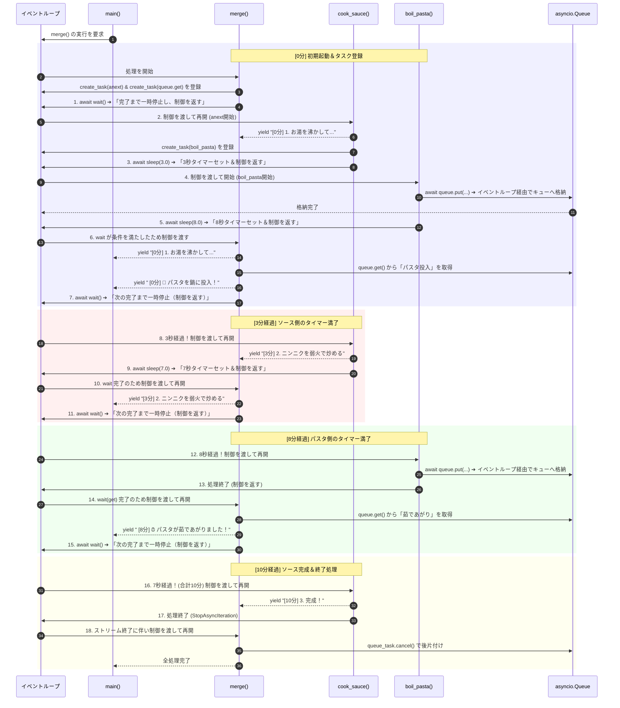

```mermaid
sequenceDiagram
    autonumber
    participant EvLoop as イベントループ
    participant Main as main()
    participant Merge as merge()
    participant Sauce as cook_sauce()
    participant Pasta as boil_pasta()
    participant Queue as asyncio.Queue

    Main->>EvLoop: merge() の実行を要求
    
    rect rgb(240, 240, 255)
    note over Merge, Pasta: [0分] 初期起動＆タスク登録
    EvLoop->>Merge: 処理を開始
    Merge->>EvLoop: create_task(anext) & create_task(queue.get) を登録
    Merge->>EvLoop: 1. await wait() ➔ 「完了まで一時停止し、制御を返す」
    
    EvLoop->>Sauce: 2. 制御を渡して再開 (anext開始)
    Sauce-->>Merge: yield "[0分] 1. お湯を沸かして..."
    Sauce->>EvLoop: create_task(boil_pasta) を登録
    Sauce->>EvLoop: 3. await sleep(3.0) ➔ 「3秒タイマーセット＆制御を返す」
    
    EvLoop->>Pasta: 4. 制御を渡して開始 (boil_pasta開始)
    Pasta->>Queue: await queue.put(...) ➔ イベントループ経由でキューへ格納
    Queue-->>EvLoop: 格納完了
    Pasta->>EvLoop: 5. await sleep(8.0) ➔ 「8秒タイマーセット＆制御を返す」
    
    EvLoop->>Merge: 6. wait が条件を満たしたため制御を渡す
    Merge-->>Main: yield "[0分] 1. お湯を沸かして..."
    Merge->>Queue: queue.get() から「パスタ投入」を取得
    Merge-->>Main: yield "  [0分] 🍝 パスタを鍋に投入！"
    Merge->>EvLoop: 7. await wait() ➔ 「次の完了まで一時停止（制御を返す）」
    end

    rect rgb(255, 240, 240)
    note over Sauce, Merge: [3分経過] ソース側のタイマー満了
    EvLoop->>Sauce: 8. 3秒経過！制御を渡して再開
    Sauce-->>Merge: yield "[3分] 2. ニンニクを弱火で炒める"
    Sauce->>EvLoop: 9. await sleep(7.0) ➔ 「7秒タイマーセット＆制御を返す」
    
    EvLoop->>Merge: 10. wait 完了のため制御を渡して再開
    Merge-->>Main: yield "[3分] 2. ニンニクを弱火で炒める"
    Merge->>EvLoop: 11. await wait() ➔ 「次の完了まで一時停止（制御を返す）」
    end

    rect rgb(240, 255, 240)
    note over Pasta, Merge: [8分経過] パスタ側のタイマー満了
    EvLoop->>Pasta: 12. 8秒経過！制御を渡して再開
    Pasta->>Queue: await queue.put(...) ➔ イベントループ経由でキューへ格納
    Pasta->>EvLoop: 13. 処理終了 (制御を返す)
    
    EvLoop->>Merge: 14. wait(get) 完了のため制御を渡して再開
    Merge->>Queue: queue.get() から「茹であがり」を取得
    Merge-->>Main: yield "  [8分] ⏰ パスタが茹であがりました！"
    Merge->>EvLoop: 15. await wait() ➔ 「次の完了まで一時停止（制御を返す）」
    end

    rect rgb(255, 255, 240)
    note over Sauce, Merge: [10分経過] ソース完成＆終了処理
    EvLoop->>Sauce: 16. 7秒経過！(合計10分) 制御を渡して再開
    Sauce-->>Merge: yield "[10分] 3. 完成！"
    Sauce->>EvLoop: 17. 処理終了 (StopAsyncIteration)
    
    EvLoop->>Merge: 18. ストリーム終了に伴い制御を渡して再開
    Merge->>Queue: queue_task.cancel() で後片付け
    Merge-->>Main: 全処理完了
    end
```
