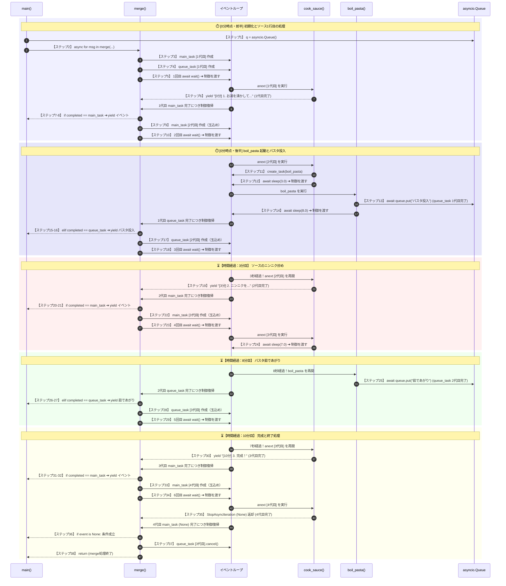

```
【ステップ1】 q = asyncio.Queue()
【ステップ2】 async for msg in merge(cook_sauce(q), q):
  [merge] 【ステップ3】 main_task = asyncio.create_task(anext(stream, None))
  [merge] 【ステップ4】 queue_task = asyncio.create_task(queue.get())
  [merge] 【ステップ5】 await asyncio.wait(waiting, return_when=asyncio.FIRST_COMPLETED)
    【ステップ6】 yield "[0分] 1. お湯を沸かしてパスタを投下"
  [merge] 【ステップ7】 if completed == main_task:
  [merge] 【ステップ8】 yield "[0分] 1. お湯を沸かしてパスタを投下"
  [merge] 【ステップ9】 main_task = asyncio.create_task(anext(stream, None))
  [merge] 【ステップ10】 await asyncio.wait(waiting, return_when=asyncio.FIRST_COMPLETED)
    【ステップ11】 asyncio.create_task(boil_pasta(queue))
    【ステップ12】 await asyncio.sleep(3.0)
      【ステップ13】 await queue.put("  [0分] 🍝 パスタを鍋に投入！")
      【ステップ14】 await asyncio.sleep(8.0)
  [merge] 【ステップ15】 elif completed == queue_task:
  [merge] 【ステップ16】 yield completed.result()  # "[0分] 🍝 パスタを鍋に投入！"
  [merge] 【ステップ17】 queue_task = asyncio.create_task(queue.get())
  [merge] 【ステップ18】 await asyncio.wait(waiting, return_when=asyncio.FIRST_COMPLETED)
    【ステップ19】 yield "[3分] 2. ニンニクを弱火で炒める"
  [merge] 【ステップ20】 if completed == main_task:
  [merge] 【ステップ21】 yield "[3分] 2. ニンニクを弱火で炒める"
  [merge] 【ステップ22】 main_task = asyncio.create_task(anext(stream, None))
  [merge] 【ステップ23】 await asyncio.wait(waiting, return_when=asyncio.FIRST_COMPLETED)
    【ステップ24】 await asyncio.sleep(7.0)
      【ステップ25】 await queue.put("  [8分] ⏰ パスタが茹であがりました！")
  [merge] 【ステップ26】 elif completed == queue_task:
  [merge] 【ステップ27】 yield completed.result()  # "[8分] ⏰ パスタが茹であがりました！"
  [merge] 【ステップ28】 queue_task = asyncio.create_task(queue.get())
  [merge] 【ステップ29】 await asyncio.wait(waiting, return_when=asyncio.FIRST_COMPLETED)
    【ステップ30】 yield "[10分] 3. ソースとパスタを和えて完成！"
  [merge] 【ステップ31】 if completed == main_task:
  [merge] 【ステップ32】 yield "[10分] 3. ソースとパスタを和えて完成！"
  [merge] 【ステップ33】 main_task = asyncio.create_task(anext(stream, None))
  [merge] 【ステップ34】 await asyncio.wait(waiting, return_when=asyncio.FIRST_COMPLETED)
    【ステップ35】 (cook_sauce generator completed / StopAsyncIteration)
  [merge] 【ステップ36】 if event is None:
  [merge] 【ステップ37】 queue_task.cancel()
  [merge] 【ステップ38】 return (merge完了)
```
