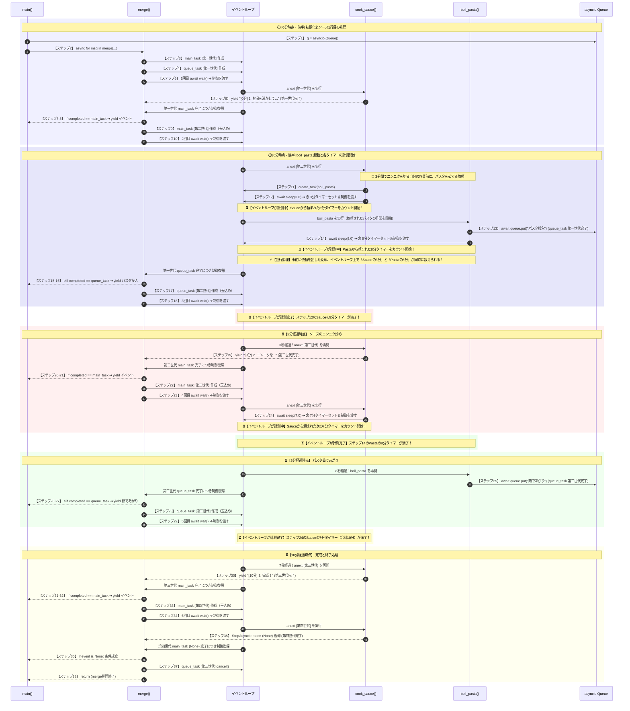

# Python Asyncio Execution Patterns & Event Loop Dynamics

# 0. 目的
asyncio を活用した非同期・並行処理の実装パターンとその内部挙動（イベントループ制御）を深く理解する。

### **`create_task` / `await` による基本的な並列化**
   - ブロッキング処理 (`time.sleep`) と非同期待機 (`asyncio.sleep`) の動作比較
### **`anext` および `async for` による非同期ストリーム処理**
   - 直列実行と Task 化による並行実行のレスポンスタイム比較
   - I/O待ち時間を活用したシステム全体の非ブロッキング化の検証
### **`asyncio.Queue` と `asyncio.wait` を組み合わせたイベント駆動型マージ処理**
   - 非同期ジェネレータ（Stream）とバックグラウンドタスク（Queue）の動的集約
   - イベントループにおけるタスク切り替え・ライフサイクル制御（タスク生成〜キャンセル）の可視化


# 1. create_task / await による非同期処理
```
# python3 example_asyncioSleep.py
サブタスク1 ...
サブタスク2 ...
（約1秒待機）
... サブタスク1 Done!
... サブタスク2 Done!
```

```
# python3 example_timeSleep.py
サブタスク1 ...
（1秒待機）
... サブタスク1 Done!
サブタスク2 ...
（1秒待機）
... サブタスク2 Done!
```

# 2. anext によるStream処理
```
# python3 example_anext.py
--- 直列実行 (async) ---
Hello1
World1
Hello2
World2
直列の所要時間: 8.0秒

--- 並行実行 (async + Task) ---
Hello1
Hello2
World1
World2
並行の所要時間: 4.0秒
```

# 3. anext for によるStream処理
```
# python3 example_anextFor.py
--- 直列実行（async for）---
Hello1
World1
Hello2
World2
直列の所要時間: 8.0秒

--- 並行実行（async for + Task）---
Hello1
Hello2
World1
World2
並行の所要時間: 4.0秒
```

一見すると、async forで8秒かかるケースは単体だと非効率に見えますが、本質はI/O待ち（通信やデータ取得）の間もシステム全体を止めない点にあります。通常のforはI/O待ち中に処理をブロックしますが、async forはawaitのたびに制御権をイベントループへ返却します。これにより、処理順序や負荷を安全に保つ直列実行でありながら、待機中も他のWebリクエストや別タスクを止めずに実行できるのが最大のメリットです。


# 4. Queueを用いたイベント駆動処理
非同期処理におけるイベント駆動アーキテクチャです。メイン進行をジェネレータで管理しつつ、裏で動くサブタスクの通知をQueueで受ける役割分離や、asyncio.waitを用いて複数のイベントを届いた順に即時処理する手法を提示しています。なお、一般的に複数のシーケンサがあると基準となる時間軸が競合し制御が複雑化するため、1つのメイン処理で進行を管理します。タイミングが不定なサブ作業はQueue等の通知で受け取り管理します。

| 仕組み | データ取得方式 | 適した用途 |
| :--- | :--- | :--- |
| **`anext` (ジェネレータ)** | **Pull型** | 順番に1つずつ処理を進めたいメインストリームでシーケンサの役割を果たす |
| **`Queue`** | **Push型** | バックグラウンドで独立して動くタスクからのイベント通知 |


```
# python3 test2.py
【ステップ1】 q = asyncio.Queue()
【ステップ2】 async for msg in merge(gen, q):
  [merge] 【ステップ3】 main_task = asyncio.create_task(anext(stream, None))
  [merge] 【ステップ4】 queue_task = asyncio.create_task(queue.get())
  [merge] 【ステップ5】 await asyncio.wait(waiting, return_when=asyncio.FIRST_COMPLETED)
    【ステップ6】 yield "[0分] 1. お湯を沸かしてパスタを投下"
  [merge] 【ステップ7】 if completed == main_task:
  [merge] 【ステップ8】 yield "[0分] 1. お湯を沸かしてパスタを投下"
  [merge] 【ステップ9】 main_task = asyncio.create_task(anext(stream, None))
  [merge] 【ステップ10】 await asyncio.wait(waiting, return_when=asyncio.FIRST_COMPLETED)
    【ステップ11】 pasta_task = asyncio.create_task(boil_pasta(queue))
    【ステップ12】 await asyncio.sleep(3.0)
      【ステップ13】 await queue.put("  [0分] 🍝 パスタを鍋に投入！")
      【ステップ14】 await asyncio.sleep(8.0)
  [merge] 【ステップ15】 elif completed == queue_task:
  [merge] 【ステップ16】 yield completed.result()  # "[0分] 🍝 パスタを鍋に投入！"
  [merge] 【ステップ17】 queue_task = asyncio.create_task(queue.get())
  [merge] 【ステップ18】 await asyncio.wait(waiting, return_when=asyncio.FIRST_COMPLETED)
    【ステップ19】 yield "[3分] 2. ニンニクを弱火で炒める"
  [merge] 【ステップ20】 if completed == main_task:
  [merge] 【ステップ21】 yield "[3分] 2. ニンニクを弱火で炒める"
  [merge] 【ステップ22】 main_task = asyncio.create_task(anext(stream, None))
  [merge] 【ステップ23】 await asyncio.wait(waiting, return_when=asyncio.FIRST_COMPLETED)
    【ステップ24】 await asyncio.sleep(7.0) and pasta_task
      【ステップ25】 await queue.put("  [8分] ⏰ パスタが茹であがりました！")
  [merge] 【ステップ26】 elif completed == queue_task:
  [merge] 【ステップ27】 yield completed.result()  # "[8分] ⏰ パスタが茹であがりました！"
  [merge] 【ステップ28】 queue_task = asyncio.create_task(queue.get())
  [merge] 【ステップ29】 await asyncio.wait(waiting, return_when=asyncio.FIRST_COMPLETED)
    【ステップ30】 yield "[10分] 3. ソースとパスタを和えて完成！"
  [merge] 【ステップ31】 if completed == main_task:
  [merge] 【ステップ32】 yield "[10分] 3. ソースとパスタを和えて完成！"
  [merge] 【ステップ33】 main_task = asyncio.create_task(anext(stream, None))
  [merge] 【ステップ34】 await asyncio.wait(waiting, return_when=asyncio.FIRST_COMPLETED)
    【ステップ35】 (cook_sauce generator completed / StopAsyncIteration)
  [merge] 【ステップ36】 if event is None:
  [merge] 【ステップ37】 queue_task.cancel()
  [merge] 【ステップ38】 return (merge完了)
```



# 5. Strands Async Multi-Agent System - Implementation Steps

Strands フレームワークにおける複数エージェント（オーケストレーターとサブエージェント）の連携処理を、**完全同期処理（Step 0）** から **非同期リアルタイム・ストリーム合流（Step 3）** へと段階的に進化させる手順を解説するものです。


```
[ Step 0: 完全同期（Sync）による単一実行 ]
  └── ブロッキング関数（def / agent()）で順番に呼び出し

       ↓

[ Step 1: 関数と呼び出しの非同期化（async/await） ]
  └── async def化、invoke_async()、asyncio.run() への移行

       ↓

[ Step 2: オーケストレーターのストリーム受信 ]
  └── stream_async() によるトークン/イベントのリアルタイム出力と型チェック

       ↓

[ Step 3: 親子ストリームの多重化・合流（完成形） ]
  └── asyncio.Queue による進捗送信 ＋ merge_streams() による asyncio.wait 並行受領
```

### 5-1. Step 0: `step0.py` - 完全同期処理（ベースライン）
すべての処理を通常の関数（`def`）と同期型の呼び出し（`agent(...)`）で記述した初期実装です。

* **特徴:**
  - 処理はシンプルですが、すべての処理が完了するまで中間状態や進捗ログをリアルタイムで出力できません。
  - 親（オーケストレーター）がサブエージェントを呼ぶ際もブロック（待機）が発生します。

### 5-2. Step 1: `step1.py` - 非同期処理（`async/await`）への移行
Python の `asyncio` を導入し、エージェントやツールの呼び出しを非同期関数へ変更しました。

* **主要な変更点:**
  1. ツール関数（`mcp_agent`, `reporter_agent`）の宣言を `def` から `async def` に変更。
  2. サブエージェントの実行を `agent(...)` から `await agent.invoke_async(...)` に変更。
  3. オーケストレーターの実行を `await orchestrator.invoke_async(...)` に変更。
  4. メイン処理を `async def main()` にまとめ、`asyncio.run(main())` で実行。

### 5-3. Step 2: `step2.py` - ストリーミング化（`stream_async`）
一括応答（`invoke_async`）から、生成結果をトークン単位で段階的に受け取る `stream_async` へ変更しました。

* **主要な変更点:**
  1. サブエージェント内で `async for event in agent.stream_async(...)` を使用。データ型（`str` 型 / `dict` 型）に応じたテキスト抽出処理を追加。
  2. メイン処理側で `orchestrator.stream_async(...)` をループ受領し、オーケストレーターが発行するイベントログを逐次画面に出力。

### 5-4. Step 3: `step3.py` - Queue と `asyncio.wait` による親子ストリームの統合（完成形）
サブエージェント側の進捗（開始/完了通知）を `asyncio.Queue` に送り、親のストリームと統合してリアルタイム出力する `merge_streams` を構築しました。

* **主要な変更点:**
  1. **状態管理クラス (`SubAgentState`) と Queue の準備:**
     グローバル変数 (`_mcp_state`, `_reporter_state`) を通じて共有 `asyncio.Queue` を保持。
  2. **進捗通知関数 (`send_event`):**
     サブエージェントの開始時と完了時に `queue.put({"event": {"subAgentProgress": ...}})` でイベントを送信。
  3. **ストリーム合流関数 (`merge_streams`):**
     - 親ストリームからの受領 (`anext`) と子キューからの受領 (`queue.get()`) をそれぞれタスク化。
     - `asyncio.wait(..., return_when=asyncio.FIRST_COMPLETED)` により、準備ができた方のイベントを即座に `yield` 出力。

| 構成要素 | 4章のコード | Step 3 コード (`step3.py`) | 役割・機能 |
| :--- | :--- | :--- | :--- |
| **親タスク（ストリーム生成）** | `cook_sauce(queue)` | `orchestrator.stream_async(...)` | メインの進捗や出力を発生させるジェネレーター/ストリーム |
| **子タスク（非同期処理）** | `boil_pasta(queue)` | `mcp_agent`, `reporter_agent` | バックグラウンド等で並行・呼び出されて実行される処理 |
| **子タスク起動のトリガー** | `asyncio.create_task(boil_pasta(queue))` | オーケストレーターによるツール自動呼び出し | 子タスクを実行状態にし、キューへメッセージを送れる状態にする |
| **通知の送信** | `await queue.put(...)` | `await send_event(queue, ...)` | 子タスクからキューへ進捗イベントを投入する |
| **合流処理関数** | `merge(stream, queue)` | `merge_streams(stream, queue)` | 親ストリームと子キューの2つの非同期ソースを1つにまとめて出力する |
| **親の次の要素取得** | `anext(stream, None)` | `anext(stream, None)` | 親ストリームから非同期で次の1要素を取り出す |
| **キューの次の要素取得** | `queue.get()` | `queue.get()` | 子キューから非同期で次の1要素を取り出す |
| **完了待ちと取り出し** | `asyncio.wait(..., return_when=FIRST_COMPLETED)` | `asyncio.wait(..., return_when=FIRST_COMPLETED)` | 親・子のうち、先にデータが準備できた方を取り出して `yield` する |
| **全体実行（呼び出し）** | `async for msg in merge(gen, q):` | `async for merged_event in merge_streams(stream, queue):` | 合流したストリームから順次イベントを取り出して処理・出力する |

### 5-5. 実行手順

各ステップの動作確認は以下のコマンドで順に実行可能です。

```
# Step 0: 同期処理での実行確認
python step0.py

# Step 1: 非同期化 (async/await) の実行確認
python step1.py

# Step 2: オーケストレーターの単一ストリーム受信確認
python step2.py

# Step 3: 親子ストリームの合流リアルタイム出力確認
python step3.py
```
