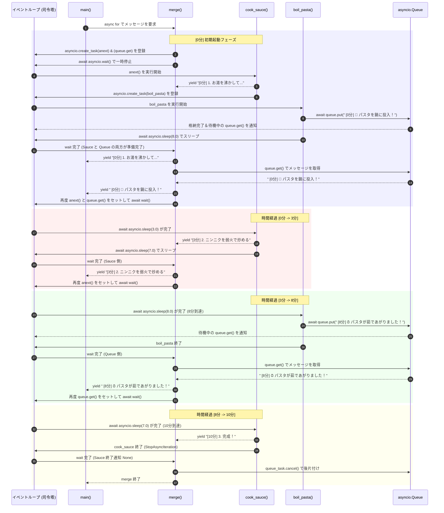

```mermaid
sequenceDiagram
    autonumber
    participant EvLoop as イベントループ (司令塔)
    participant Main as main()
    participant Merge as merge()
    participant Sauce as cook_sauce()
    participant Pasta as boil_pasta()
    participant Queue as asyncio.Queue

    Main->>Merge: async for でメッセージを要求
    
    rect rgb(240, 240, 255)
    note over Merge, Sauce: [0分] 初期起動フェーズ
    Merge->>EvLoop: asyncio.create_task(anext) & (queue.get) を登録
    Merge->>EvLoop: await asyncio.wait() で一時停止
    
    EvLoop->>Sauce: anext() を実行開始
    Sauce-->>Merge: yield "[0分] 1. お湯を沸かして..."
    Sauce->>EvLoop: asyncio.create_task(boil_pasta) を登録
    
    EvLoop->>Pasta: boil_pasta を実行開始
    Pasta->>Queue: await queue.put("  [0分] 🍝 パスタを鍋に投入！")
    Queue-->>EvLoop: 格納完了＆待機中の queue.get() を通知
    Pasta->>EvLoop: await asyncio.sleep(8.0) でスリープ
    
    EvLoop->>Merge: wait 完了 (Sauce と Queue の両方が準備完了)
    Merge-->>Main: yield "[0分] 1. お湯を沸かして..."
    Merge->>Queue: queue.get() でメッセージを取得
    Queue-->>Merge: "  [0分] 🍝 パスタを鍋に投入！"
    Merge-->>Main: yield "  [0分] 🍝 パスタを鍋に投入！"
    Merge->>EvLoop: 再度 anext() と queue.get() をセットして await wait()
    end

    rect rgb(255, 240, 240)
    note over Sauce, Pasta: 時間経過 [0分 -> 3分]
    EvLoop->>Sauce: await asyncio.sleep(3.0) が完了
    Sauce-->>Merge: yield "[3分] 2. ニンニクを弱火で炒める"
    Sauce->>EvLoop: await asyncio.sleep(7.0) でスリープ
    
    EvLoop->>Merge: wait 完了 (Sauce 側)
    Merge-->>Main: yield "[3分] 2. ニンニクを弱火で炒める"
    Merge->>EvLoop: 再度 anext() をセットして await wait()
    end

    rect rgb(240, 255, 240)
    note over Sauce, Pasta: 時間経過 [3分 -> 8分]
    EvLoop->>Pasta: await asyncio.sleep(8.0) が完了 (8分到達)
    Pasta->>Queue: await queue.put("  [8分] ⏰ パスタが茹であがりました！")
    Queue-->>EvLoop: 待機中の queue.get() を通知
    Pasta->>EvLoop: boil_pasta 終了
    
    EvLoop->>Merge: wait 完了 (Queue 側)
    Merge->>Queue: queue.get() でメッセージを取得
    Queue-->>Merge: "  [8分] ⏰ パスタが茹であがりました！"
    Merge-->>Main: yield "  [8分] ⏰ パスタが茹であがりました！"
    Merge->>EvLoop: 再度 queue.get() をセットして await wait()
    end

    rect rgb(255, 255, 240)
    note over Sauce, Merge: 時間経過 [8分 -> 10分]
    EvLoop->>Sauce: await asyncio.sleep(7.0) が完了 (10分到達)
    Sauce-->>Merge: yield "[10分] 3. 完成！"
    Sauce->>EvLoop: cook_sauce 終了 (StopAsyncIteration)
    
    EvLoop->>Merge: wait 完了 (Sauce 終了通知 None)
    Merge->>Queue: queue_task.cancel() で後片付け
    Merge-->>Main: merge 終了
    end
```
